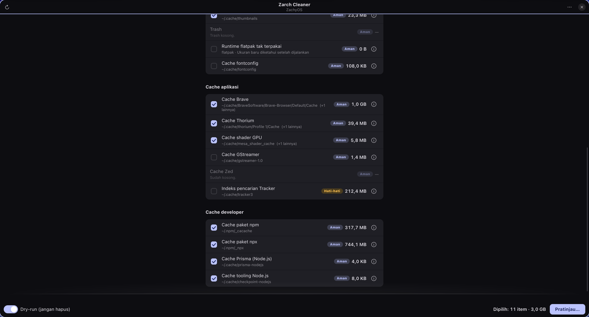

# Zarch Cleaner

Pembersih sistem ber-antarmuka GTK4 untuk **Arch Linux** dan turunannya
(CachyOS, EndeavourOS, Manjaro, Garuda, dan lain-lain).



Zarch Cleaner memindai sistem, **mengukur** berapa ruang yang bisa dibebaskan
setiap item, lalu membiarkan kamu memilih apa yang benar-benar dihapus. Tidak ada
penghapusan otomatis, dan dry-run aktif secara default.

Dibangun dengan Python 3 + PyGObject (GTK4 + libadwaita). **Tanpa dependensi pip.**

## Instalasi

Butuh `python3`, `python-gobject`, `gtk4`, dan `libadwaita` (semuanya ada di repo
resmi Arch). Untuk item cache paket, pasang juga `pacman-contrib` yang menyediakan
`paccache`:

```sh
sudo pacman -S --needed python-gobject gtk4 libadwaita pacman-contrib polkit
```

**Jalankan tanpa install:**

```sh
git clone https://github.com/adamzakys/zarch-cleaner.git
cd zarch-cleaner
./run.sh
```

**Install permanen:**

```sh
make install     # ke ~/.local (butuh ~/.local/bin di PATH)
zarch-cleaner
```

Setelah `make install`, aplikasi juga muncul di launcher dengan nama dan ikonnya
sendiri. Hapus lagi dengan `make uninstall`; konfigurasi di
`~/.config/zarch-cleaner` sengaja dibiarkan.

| Perintah | Kegunaan |
| --- | --- |
| `make run` | jalankan langsung dari kode sumber |
| `make test` | jalankan semua test |
| `make install` / `make uninstall` | pasang / hapus pemasangan ke `~/.local` |
| `make install-polkit` | opsional, lihat [Model keamanan](#model-keamanan) |
| `make clean` | hapus `__pycache__` dan berkas sementara |

## Model keamanan

Ini bagian terpenting dari aplikasi yang menghapus berkas, jadi dibuat berlapis:

- **Dry-run aktif secara default.** Selama sakelar dry-run menyala, tombolnya
  hanya memperlihatkan rencana; tidak ada operasi yang dijalankan.
- **Allowlist, bukan blocklist.** Setiap target penghapusan harus berada di dalam
  daftar izin yang ditulis di `zarchcleaner/safety.py`. Daftar itu hanya bisa
  diperluas dengan mengubah kode, tidak lewat konfigurasi atau data saat runtime.
- **Target ditulis di kode.** Item hanya dibuat dari definisi statis di
  `zarchcleaner/cleaners/`. Path tidak pernah berasal dari input pengguna atau
  dari hasil penelusuran direktori secara bebas.
- **Simlink tidak bisa dipakai kabur.** Selain dicek secara leksikal, path
  diresolusi dan harus tetap berada di dalam root yang diizinkan.
- **Pertahanan berlapis di sisi root.** Helper yang berjalan sebagai root
  memvalidasi ulang setiap target lewat modul `safety` yang sama, jadi rencana
  yang dimodifikasi pun tetap ditolak.
- **Konfirmasi sepadan risikonya.** Item `Berisiko` (mis. penghapusan paket
  orphan) tidak aktif secara default dan mewajibkan mengetik `HAPUS` saat dry-run
  dimatikan.
- **Tanpa shell.** Perintah dijalankan sebagai daftar argumen, tidak lewat shell,
  sehingga argumen seperti `;` tidak ditafsirkan.
- **`/boot` tidak pernah disentuh.** Kernel dan initramfs di sana dihasilkan oleh
  hook pacman dan tidak dimiliki paket mana pun, sehingga deteksi otomatis
  "kernel sisa" tidak bisa dibuat aman. Karena itu tidak ada fitur tersebut.

Operasi yang butuh root dijalankan lewat `pkexec`, sehingga kamu melihat dialog
autentikasi polkit. Kalau polkit tidak tersedia atau dialognya ditutup, aplikasi
menawarkan menjalankannya lewat `sudo` di jendela terminal.

`make install-polkit` bersifat **opsional**. Tanpa berkas itu pun `pkexec` sudah
bekerja dengan benar memakai kebijakan bawaan polkit; memasangnya hanya membuat
teks dialognya lebih spesifik. Lihat komentar di
`data/io.github.adamzakys.ZarchCleaner.policy.in` untuk batasannya.

## Yang dibersihkan

### Paket dan repositori

| Item | Default | Catatan |
| --- | --- | --- |
| Versi lama paket terunduh | aktif | `paccache -rk1`, menyisakan 1 versi terbaru |
| Cache paket tidak terinstall | nonaktif | `paccache -ruk0` |
| Seluruh cache paket | nonaktif | `paccache -rk0` — downgrade offline jadi tidak mungkin |
| Paket orphan | nonaktif | `pacman -Rns`, risiko tinggi, perlu ketik konfirmasi |
| Log pacman | nonaktif | mengosongkan `/var/log/pacman.log` |
| Build cache AUR | aktif | isi `~/.cache/yay`, `~/.cache/paru`, dan sejenisnya |

Ukuran cache paket diukur dari `paccache -d`, jadi angkanya yang benar-benar bisa
dibebaskan, bukan tebakan dari besar direktori.

### Sampah sistem

| Item | Default | Catatan |
| --- | --- | --- |
| Log systemd journal | aktif | `journalctl --vacuum-time=2weeks` |
| Berkas sementara lama | nonaktif | hanya lapisan teratas `/tmp` dan `/var/tmp` |
| Cache thumbnail | aktif | dibuat ulang otomatis |
| Trash | aktif | `gio trash --empty` |
| Runtime flatpak tak terpakai | nonaktif | `flatpak uninstall --unused -y` |
| Cache fontconfig | nonaktif | dibuat ulang otomatis |

### Cache aplikasi

Brave, Thorium, Chromium, Chrome, Vivaldi, dan Edge — **hanya** subdirektori cache
(`Cache`, `Code Cache`, `GPUCache`, dan sejenisnya). Cookie, login, riwayat, dan
data profil lain tidak disentuh. Selain itu: cache shader GPU (Mesa, Qt, NVIDIA),
cache GStreamer, cache Zed, dan indeks pencarian Tracker.

### Cache developer

npm (`_cacache` dan `_npx`), pip, uv, engine Prisma, cache tooling Node.js, serta
browser Playwright dan Puppeteer (keduanya nonaktif secara default).

## Pengaturan

`~/.config/zarch-cleaner/config.json`:

```json
{
  "dry_run": true,
  "keep_cached_versions": 1,
  "tmp_max_age_days": 10,
  "journal_vacuum": "time=2weeks",
  "selected_items": []
}
```

`journal_vacuum` divalidasi terhadap pola `time=...` atau `size=...` sebelum
diteruskan ke `journalctl`.

Riwayat run terakhir ditulis ke `~/.local/state/zarch-cleaner/last-run.json` dan
bisa dibuka dari menu **Laporan terakhir**.

## Tampilan

Desainnya sengaja mengikuti Arch, bukan tema bawaan GNOME:

- Aksen memakai **Arch blue `#1793d1`**, di-*override* lewat nama warna libadwaita
  sehingga switch, tombol yang disarankan, dan seleksi ikut berubah warna.
- Ikon aplikasi: puncak bersudut di atas latar biru bergradasi, dengan sparkle
  kecil sebagai penanda fungsi pembersih. Bentuknya *terinspirasi* gaya Arch dan
  bukan salinan logo resmi Arch Linux.
- Judul jendela menampilkan nama distribusi yang sedang berjalan di bawah judul,
  dan grup Ringkasan memuat distro, versi kernel, serta versi pacman.
- Path dan perintah ditampilkan dengan huruf monospace mengikuti kebiasaan
  pengguna Arch.

## Test

```sh
make test
```

Test tidak memerlukan hak akses root dan tidak menyentuh berkas asli: sandbox
dibuat di dalam `~/.cache`, yang memang termasuk allowlist, sehingga jalur kode
penghapusan yang asli tetap teruji. Totalnya 96 test.

Yang dipastikan antara lain: allowlist menolak `/etc`, `~/.ssh`, dan traversal
`..`; simlink tidak bisa dipakai keluar dari root allowlist; rencana yang
dimodifikasi tetap ditolak oleh kode sisi helper; dry-run tidak mengubah apa pun;
helper menolak dijalankan tanpa hak root; dan argumen perintah tidak pernah
ditafsirkan oleh shell.

## Batasan yang diketahui

- Penghapusan paket orphan memakai `--noconfirm`; konfirmasinya dilakukan di
  aplikasi ini, bukan oleh pacman.
- Ukuran runtime flatpak baru diketahui setelah perintahnya dijalankan, karena
  flatpak 1.18 tidak punya mode pratinjau.
- Cache browser yang tersimpan di `~/.config` (mis. `GPUCache` sebagian profil)
  sengaja tidak disentuh, karena allowlist hanya mencakup direktori cache.
- Item journal butuh systemd. Di distro Arch tanpa systemd, item itu otomatis
  ditandai tidak tersedia.
- Aplikasi ini tidak menyentuh `/boot`, jadi tidak ada pembersihan kernel lama.
- Belum ada paket AUR untuk proyek ini.

## Lisensi

MIT — lihat [LICENSE](LICENSE).
